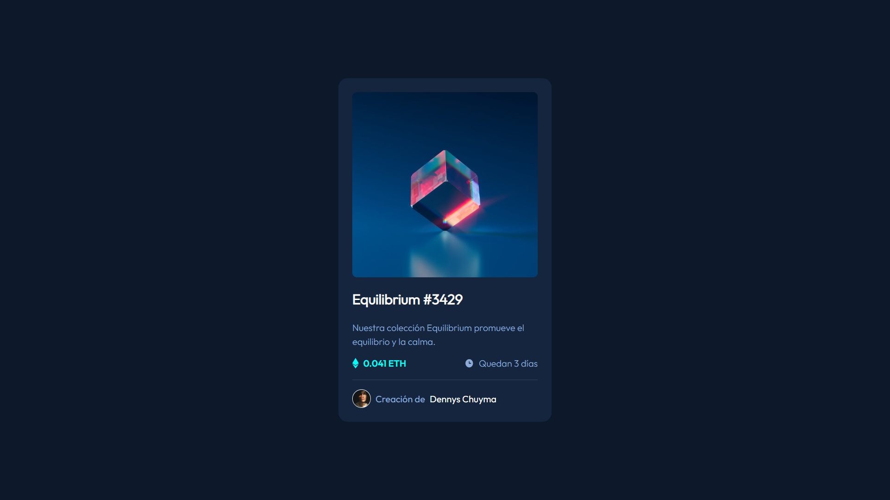

# Componente de tarjeta de vista previa NFT

Esta es una solución al [desafío del componente de tarjeta de vista previa de NFT en Frontend Mentor](https://www.frontendmentor.io/challenges/nft-preview-card-component-SbdUL_w0U).

## Tabla de contenido

- [Resumen](#resumen)
  - [El reto](#el-reto)
  - [Captura de pantalla](#captura-de-pantalla)
  - [Enlaces](#enlaces)
- [Mi proceso](#mi-proceso)
  - [Construido con](#construido-con)
  - [Que aprendí](#que-aprendí)
  - [Desarrollo continuo](#desarrollo-continuo)
  - [Recursos útiles](#recursos-útiles)
- [Autor](#autor)
- [Agradecimientos](#agradecimientos)


## Visión general

### El reto

Los usuarios deben ser capaces de:

- Ver el diseño óptimo según el tamaño de pantalla de su dispositivo
- Ver estados de desplazamiento para elementos interactivos

### Captura de pantalla




### Enlaces

- URL de la solución: [https://github.com/denn-c/003-tarjeta-de-vista-previa-nft](https://github.com/denn-c/003-tarjeta-de-vista-previa-nft)
- URL del sitio en vivo: [https://denn-c.github.io/003-tarjeta-de-vista-previa-nft/](https://denn-c.github.io/003-tarjeta-de-vista-previa-nft/)

## Mi proceso

### Construido con

- Marcado HTML5 semántico
- Propiedades personalizadas de CSS
- Caja flexible

### Que aprendí

Diseñar, crear y mantener sitios web, proporcionando en el proceso un portal online coherente y fácil de usar para los clientes, compañeros de trabajo y otras partes implicadas. Incorporan contenido, imágenes, gráficos, vídeos y otras utilidades para crear sitios atractivos con los que los usuarios querrán interactuar.  

Fragmentos de código con mayor relevancia en este proyecto.

**HTML**

```html
<body>
    <main class="main">
      <a href="#" class="main__link">
        
        <div class="main__view"></div>
      </a>
      <a href="#" class="main__a">
        <h1 class="main__title">Equilibrium #3429</h1>
      </a>
      <p class="main__description">
        Nuestra colección Equilibrium promueve el equilibrio y la calma.
      </p>
      <article class="main__promo">
        <section class="main__section">
          
          <p class="main__price">0.041 ETH</p>
        </section>
        <section class="main__section">
          
          <p class="main__date">Quedan 3 días</p>
        </section>
      </article>
      <footer class="main__footer">
        
        <p class="main__name">
          Creación de <a href="#" class="main__author">Dennys Chuyma</a>
        </p>
      </footer>
    </main>
  </body>
```
**CSS**
```css
:root{
  /* Primary */
--Soft-blue: hsl(215, 51%, 70%);
--Cyan: hsl(178, 100%, 50%);

/* Neutral */
--Very-dark-blue-main: hsl(217, 54%, 11%);
--Very-dark-blue-card: hsl(216, 50%, 16%);
--Very-dark-blue-line: hsl(215, 32%, 27%);
--White: hsl(0, 0%, 100%);
}

@font-face {
  font-family: "Outfit Light";
  src: url(../asset/fonts/Outfit-Light.ttf);
}
@font-face {
  font-family: "Outfit Regular";
  src: url(../asset/fonts/Outfit-Regular.ttf);
}
@font-face {
  font-family: "Outfit SemiBold";
  src: url(../asset/fonts/Outfit-SemiBold.ttf);
}
*{
  font-family: "Outfit Light";
}
body{
  background-color: var(--Very-dark-blue-main);
  min-height: 100vh;
  display: flex;
  align-items: center;
  justify-content: center;
}
a{
  text-decoration: none;
}

.main{
  background-color: var(--Very-dark-blue-card);
  border-radius: 1em;
  width: 23em;
  padding: 1.5em;
  margin: 1em;
}
.main__link{
  position: relative;
  display: block;
}

.main__fondo{
  border-radius: .5em;
}
.main__link:hover > .main__view{
  width: 100%;
  height: 100%;
  display: block;
  background-image: url(../asset/icon/icon-view.svg);
  border-radius: .5em;
  background-repeat: no-repeat;
  background-position: center;
  position: absolute;
  top: 0;
}
.main__link:hover > .main__view::after{
  content: "";
  display: block;
  width: 100%;
  height: 100%;
  background-color: rgba(52, 241, 241, 0.5);
  position: absolute;
  top: 0;
  border-radius: .5em;
} 

.main__title{
  color: var(--White);
  font-size: 1.5em;
  margin: 1em 0;
}
.main__title:hover{
  color: var(--Cyan);
}
.main__description{
  color: var(--Soft-blue);
  line-height: 1.5em;
}
.main__promo,
.main__section{
  display: flex;
  justify-content: space-between;
}
.main__price,
.main__date{
  margin: 0;
  margin-left: .5em;
}
.main__promo{
  padding-bottom: 1.2em;
  border-bottom: 1px solid var(--Very-dark-blue-line);
}

.main__price{
  color: var(--Cyan);
  font-family: "Outfit SemiBold";
}
.main__date{
  color: var(--Soft-blue);
}
.main__footer{
  display: flex;
  align-items: center;
  margin: 1em 0 0;
}
.main__user{
  width: 2em;
  border-radius: 100%;
  border: 1px solid var(--White);
}
.main__name{
  font-family: "Outfit Regular";
  margin: 0;
  margin-left: .5em;
  color: var(--Soft-blue);
}
.main__author{
  font-family: "Outfit Regular";
  color: var(--White);
  margin-left: .3em;
}
.main__author:hover{
  color: var(--Cyan);
}
```
### Desarrollo continuo

- **Crear la codificación que da vida a un sitio web** y ayudar a que funcione según lo exigido por el host.  
- **Diseñar no solo el aspecto de un sitio web**, sino también su funcionamiento para el usuario final.  
- **Responsabilizarse de qué funciones se pueden realizar** cuando un usuario llega a la página web.  
- **Utilizar los últimos mecanismos y aplicaciones** para que el sitio funcione de la forma más fluida y eficiente posible.  
- **Probar sitios nuevos y existentes** y corregir posibles errores que puedan surgir.  

### Recursos útiles

- [Conceptos básicos de HTML](https://developer.mozilla.org/es/docs/Learn/Getting_started_with_the_web/HTML_basics) - Esto me ayudó en escoger las etiquetas necesarias para maquetado del HTML. Me gustó mucho este patrón y lo usaré en el futuro.
- [CSS básico](https://developer.mozilla.org/es/docs/Learn/Getting_started_with_the_web/CSS_basics)  Esto me ayudó en escoger las etiquetas necesarias para maquetado del CSS. Me gustó mucho este patrón y lo usaré en el futuro.

## Autor

- Facebook - [Dennys Chuyma](https://www.facebook.com/dennys.chuyma)
- Twitter - [@tunombredeusuario](https://www.twitter.com/tunombredeusuario)
- Mentor de frontend - [@denn-c](https://www.frontendmentor.io/profile/denn-c)

## Agradecimientos

Mis agradecimiento a los creadores de contenido de la comunidad de YouTube de indole educativo gracias a ellos fue posible la resolución de este desafió
